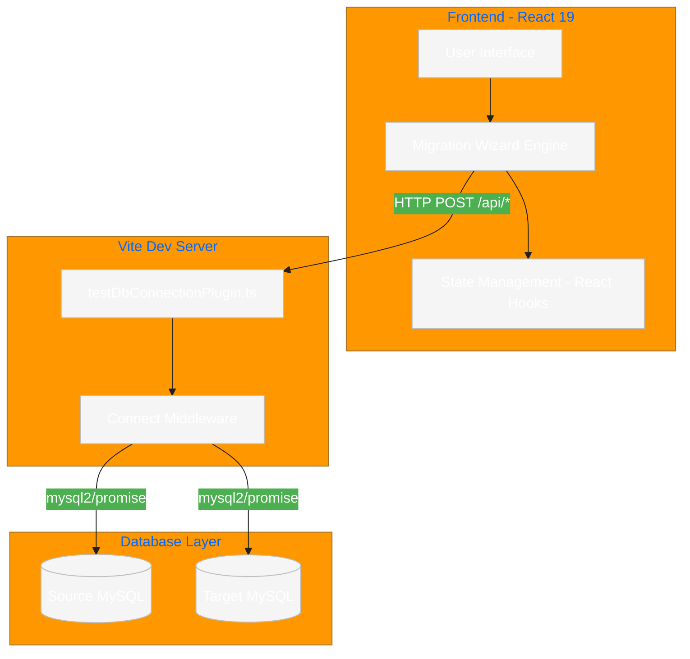

# System Architecture

This document outlines the high-level design and architectural components of DataBridge Pro.

## 🏗 High-Level Overview

DataBridge Pro is built as a modern React application that leverages a custom Vite plugin to handle backend operations. This architecture allows for a seamless development experience where the frontend and database-proxied API endpoints coexist within the same build pipeline.

### Architectural Diagram

## 🧩 Core Components

### 1. Frontend Layer (React)
- **Wizard Engine**: Orchestrates the 4-step migration workflow (`connection`, `tables`, `mapping`, `transfer`).
- **State Management**: Uses React's `useState` and `useMemo` to track connection strings, selected tables, and mapping configurations.
- **UI Components**: Built with Tailwind CSS and Framer Motion for a responsive and interactive user experience.

### 2. API Proxy Layer (Vite Plugin)
- **testDbConnectionPlugin.ts**: A custom Vite plugin that intercepts requests to `/api/*`. It runs in the Node.js environment of the Vite server, allowing it to perform direct database operations using the `mysql2` driver.
- **Middleware**: Parses incoming JSON bodies and routes requests to specific database utility functions (e.g., listing tables, fetching schemas, executing transfers).

### 3. Database Driver (`mysql2`)
- Handles all low-level communication with MySQL instances.
- Supports asynchronous operations and connection pooling (managed per-request in the current implementation).

## 🔄 Service Interactions

### Connection Validation
1. User enters credentials in the UI.
2. Frontend sends a `POST` request to `/api/test-db-connection`.
3. Vite plugin establishes a temporary connection to verify reachability and database existence.
4. Success/Failure is returned to the UI.

### Data Mapping and Transfer
1. UI fetches schema details via `/api/table-schema`.
2. User defines mappings which are stored in the frontend state.
3. Upon initiation, the frontend sends the entire migration plan (jobs) to `/api/mapped-transfer`.
4. The backend (Vite plugin) executes the transfer in batches:
    - Reads from Source DB.
    - Applies mappings and filters.
    - Performs `INSERT` (or `INSERT IGNORE`) into Target DB.
5. Progress and logs are streamed/returned to the client.

## 🛡 Security Considerations

- **Server-Side Execution**: All database credentials and queries are processed on the server-side (Vite dev server), preventing exposure of sensitive information to the browser's console or network logs (beyond the initial request).
- **Identifier Quoting**: The Vite plugin uses strict regex and backtick quoting for MySQL identifiers to prevent SQL injection.
- **Batched Processing**: Transfers are performed in configurable batches (default 500 rows) to manage memory and prevent long-running transaction timeouts.
